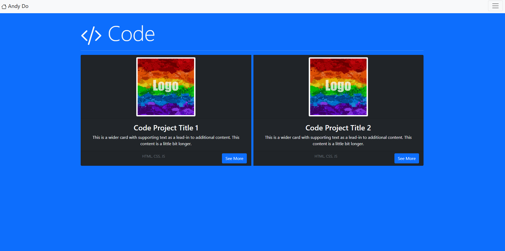

# Lab-03 Intro to Bootstrap
Interesting lab in my opinion, I was surprised how fast you can setup a template portfolio in about an hour using the included PDF. With a few different images and some extra time, I can see how Bootstrap could be used to rapidly prototype a somewhat visually pleasing webpage, although I can also see how visually limiting it can be.

No prerequisites for this lab, this lab can be opened from this [repo's github pages](https://kurolunaa.github.io/csci4208-portfolio-2025/) under Lab-03.

## Features
- Multiple HTML pages using Bootstrap
- Bootstrap icons, textboxes
- A navbar to get from one page to the other.

